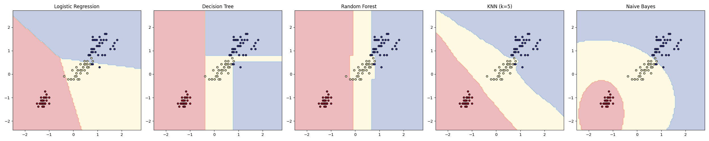

# BareMetalML

Machine learning algorithms implemented from scratch using only NumPy — no scikit-learn inside any implementation (sklearn is used only for verification and benchmark datasets).

This repo exists to build genuine understanding of how ML algorithms work under the hood: the math, the gradients, the recursive logic, the numerical edge cases — all written and debugged by hand.

## Why from scratch?

Using a library is fast. Building it yourself is how you actually learn what's happening between `.fit()` and `.predict()`. Every algorithm here was implemented, broken, debugged, and verified against scikit-learn to confirm correctness — typically matching sklearn's output to within `1e-10` or better.

## What's inside

| # | Algorithm | Key concepts |
|---|---|---|
| 01 | [Linear Regression](notebooks/linear_regression) | Normal equation, gradient descent, L2 (Ridge) regularization |
| 02 | [Logistic Regression](notebooks/logistic_regression) | Sigmoid, binary cross-entropy, One-vs-Rest multiclass |
| 03 | [Decision Tree](notebooks/decision_tree) | Gini/entropy impurity, recursive splitting, tree visualization |
| 04 | [Random Forest](notebooks/random_forest) | Bootstrap aggregation, random feature subsets, feature importance |
| 05 | [KNN](notebooks/knn) | Euclidean/Manhattan distance, classification + regression, bias-variance tradeoff |
| 06 | [Naive Bayes](notebooks/naive_bayes) | Gaussian NB, numerical stability (variance smoothing), Multinomial NB for text |
| 07 | [K-Means](notebooks/kmeans) | Random vs k-means++ initialization, elbow method, edge case handling |
| 08 | [PCA](notebooks/pca) | Eigendecomposition, explained variance, dimensionality reduction |
| — | [Comparison Notebook](notebooks/comparison) | Every classifier head-to-head on the same dataset and split |

A `utils/` package (data splitting, metrics, preprocessing, plotting) is shared across every algorithm — written first, used everywhere.

## Comparison: every classifier, same dataset

The final notebook trains every classifier on the same Iris train/test split and compares decision boundaries side by side:



| Model | Train Acc | Test Acc | Fit Time (s) |
|---|---|---|---|
| Logistic Regression | 0.9167 | 0.9333 | 0.0453 |
| Decision Tree | 1.0000 | 0.9333 | 0.0039 |
| Random Forest | 0.9583 | 0.9000 | 0.0195 |
| KNN (k=5) | 0.9583 | 0.9667 | 0.0001 |
| Naive Bayes | 0.9583 | 0.9333 | 0.0001 |

Notice the Decision Tree hitting 100% train accuracy but unremarkable test accuracy — a textbook overfitting signature, visible directly in its blocky decision boundary. KNN generalizes best here, helped by Iris's locally well-separated classes.

## Project structure

```
BareMetalML/
├── utils/                      # shared building blocks
│   ├── data_utils.py           # train_test_split
│   ├── metrics.py              # MSE, R², accuracy, precision/recall/F1, confusion matrix
│   ├── preprocessing.py        # StandardScaler, MinMaxScaler
│   └── plotting.py             # plot_decision_boundary
├── notebooks/
│   ├── linear_regression/
│   ├── logistic_regression/
│   ├── decision_tree/
│   ├── random_forest/
│   ├── knn/
│   ├── naive_bayes/
│   ├── kmeans/
│   ├── pca/
│   └── comparison/
└── README.md
```

Each algorithm folder follows the same pattern:
- `<algorithm>.py` — the implementation (importable, no top-level test code)
- `runner.py` — loads data, trains, evaluates, plots
- `test_<algorithm>.py` — verification against scikit-learn

## Getting started

```bash
git clone https://github.com/bhaskar9221/BareMetalML.git
cd BareMetalML
pip install -r requirements.txt
```

Run any algorithm's runner directly, for example:
```bash
python notebooks/linear_regression/runner.py
```

## Datasets

All datasets are built into scikit-learn — no downloads required:
- **Iris** — classification (Logistic Regression, Decision Tree, Random Forest, KNN, Naive Bayes, PCA)
- **Diabetes** — regression (Linear Regression)
- Synthetic blobs — clustering (K-Means)

## Notes on correctness

Every implementation was verified against its scikit-learn counterpart:
- Linear Regression — predictions match sklearn within `1e-10`
- Decision Tree / Random Forest — feature importances and splits validated against known Iris structure (petal length dominates, as expected)
- PCA — explained variance ratios match the well-known Iris result (~92.5% in the first component)

## What's next

Neural networks and deep learning architectures are intentionally kept out of this repo and live in a separate project, since they deserve their own from-scratch treatment (backpropagation, autograd, etc).